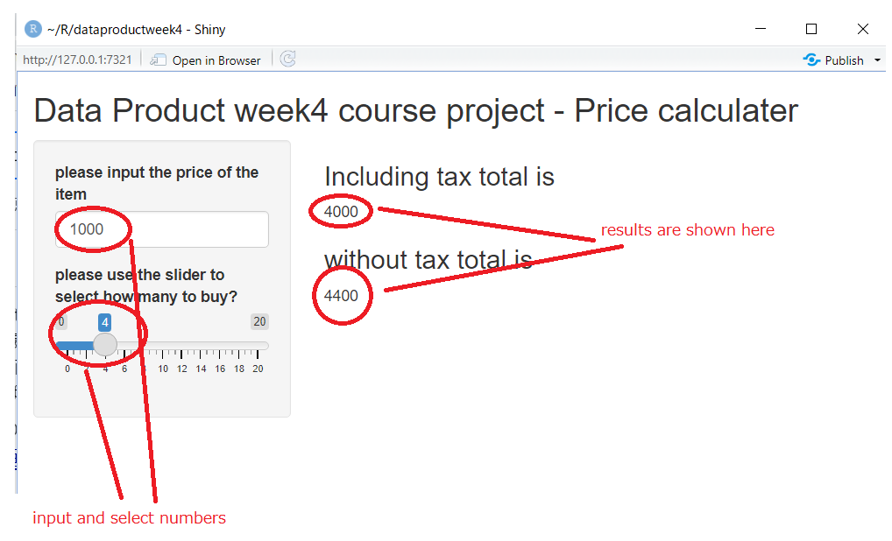

```{r setup, include=FALSE}
knitr::opts_chunk$set(echo = FALSE)
```

## Background

This is an R Markdown presentation. This is the presentation to submit for the coursera data product course on data science specialization. I will give some idea, what app I created with R shiny package and how it works.

## What is the app for

This is very simple price calculator who is coming to Japan. Users input the price of the item and also how many they buy, then the application return the total price (both with/without tax) to the user on the page.

## How it works?

Users need to input number in the box named "please input the price of the item" and also need to select how many to buy by using the slider. (slider can only afford the whole number)

once we select the numbers it returns the total price both with / without tax on the main panel.

## How it works? - illustrative

Here is a app screenshot to describe how it work.

```{r, echo=FALSE}
   
```